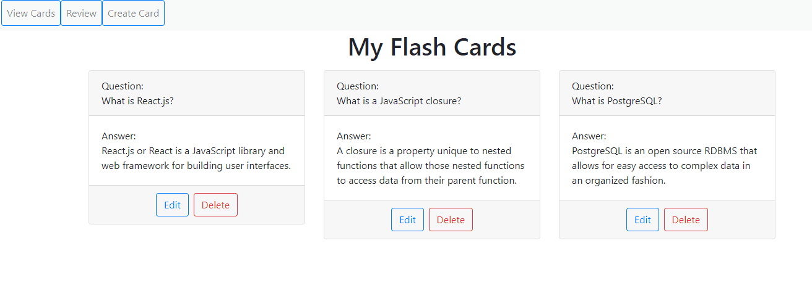

# react-flash-cards-pt

## Description
A Flash Card App built with React.js

## Live Demo
Try the application live at [https://flash-cards.lawrkim.com](https://flash-cards.lawrkim.com)

## Technologies Used
- React.js
- Bootstrap 4
- CSS3
- AWS EC2

## Features
- Students can view their current deck of flash cards
- Students can create new flash cards
- Students can delete their flash cards
- Students can update their flash cards
- Students can review their flash cards
- Students can view their progress
- Students can store their flash cards on the browser's local storage

## Preview


## Development

#### System Requirements
- NPM 6 or higher

#### Getting started
1. Clone the repository.
  ```shell
  git clone https://github.com/lawrence-kim1/react-flash-cards-pt
  cd react-flash-cards-pt
  ```
2. Install all dependencies with NPM.
  ```shell
  npm install
  ```
3. Start the project. You can view the application by opening http://localhost:3000 in your browser.
  ```shell
  npm run start
  ```
